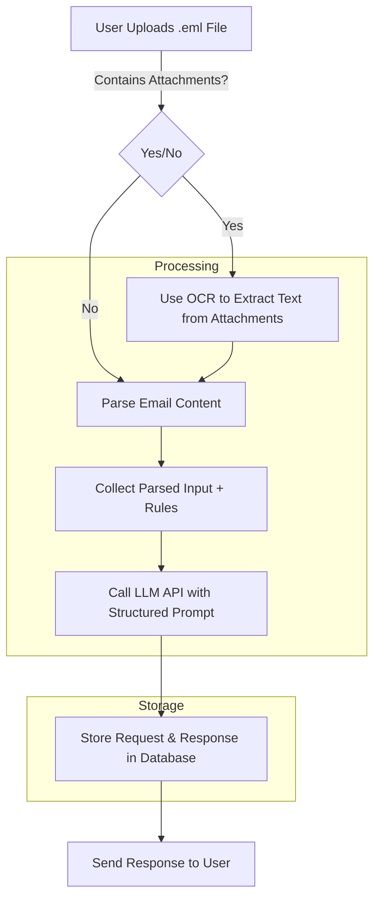

# 🚀 Email Classification System

## 📌 Table of Contents

- [Introduction](#introduction)
- [Demo](#demo)
- [Inspiration](#inspiration)
- [What It Does](#what-it-does)
- [How We Built It](#how-we-built-it)
- [Challenges We Faced](#challenges-we-faced)
- [How to Run](#how-to-run)
- [Tech Stack](#tech-stack)
- [Team](#team)

## 🎯 Introduction

This project is an **AI-powered email classification system** that helps automate the categorization of emails based on predefined rules. It utilizes **FastAPI** as the backend and integrates an **LLM (Large Language Model)** to classify emails into structured types.
The project aims to **simplify email processing** by automating classification, making it easier for organizations to handle large volumes of incoming messages efficiently.

## 🎥 Demo

📹 [Video Demo](./artifacts/demo/Final%20Prompt%20Hackers.mp4)

## 💡 Inspiration

Manually sorting and responding to emails is **time-consuming** and inefficient, especially in organizations that receive thousands of emails daily. Our goal was to build an AI-powered **email classification tool** that can analyze emails and categorize them based on **business rules** while being **easy to deploy and scale**.

## ⚙️ What It Does

- **Extracts email content** (subject, body, attachments) from `.eml` files.
- **Processes rules provided by the user** to classify emails.
- **Uses an LLM (Large Language Model)** to categorize emails into request types.
- **Stores classification results** for easy retrieval.
- **FastAPI backend** to manage API requests.

## 🛠️ How We Built It

- **FastAPI** for backend development.
- **React (Material-UI)** for the frontend.
- **LLM (via API or local model)** for classification.
- **Python's email package** for `.eml` parsing.
- **OCR and file parsers** for extracting text from attachments.

## 🚧 Challenges We Faced

- **Generating a realistic email dataset** since no sample data was provided.
- **Designing effective LLM prompts** for classification accuracy.
- **Handling diverse attachment formats** (PDF, DOCX, images).
- **Optimizing the email extraction and preprocessing pipeline.**

## 🏃 How to Run

1. Clone the repository
   ```sh
   git clone https://github.com/your-repo.git
   ```
2. Install backend dependencies
   ```sh
   pip install -r requirements.txt
   ```
3. Start the FastAPI backend
   ```sh
   uvicorn main:app --reload
   ```
4. Navigate to the frontend directory and install dependencies
   ```sh
   cd code/frontend/my-app
   npm install
   ```
5. Start the React frontend
   ```sh
   npm start
   ```

## 🏗️ Tech Stack

- 🔹 **Backend**: FastAPI (Python)
- 🔹 **Frontend**: React (Material-UI)
- 🔹 **AI Model**: Google Gemini
- 🔹 **File Parsing**: PyPDF2, python-docx, pytesseract

## 👥 Team

- **Sahethi DG**
- **Vaibhav Kumar**
- **Gourav Chayande**
- **Apoorva Chawda**
- **Sachin Thakur**

# 📌 Architecture Overview

## 🏗️ System Components

### FastAPI Backend

- Orchestrates everything (API calls, preprocessing, storing results).
- Handles email ingestion, parsing, and classification requests.

### LLM Classification

- Processes emails based on predefined rules.
- Classifies emails into relevant categories.
- Extracts key details such as request type and sub-type.

### Storage

- Stores user-defined classification rules.
- Maintains classification results for emails.

### Frontend

- Simple UI for uploading emails.
- Displays classified results in an easy-to-read format.

---

## 🛠 Components & Their Responsibilities

### 🎛️ User Interface

- Upload `.eml` files.
- View classified emails in a structured manner.

### 🚀 FastAPI Backend (Orchestrator)

- Receives and processes emails.
- Extracts email content (subject, body, attachments).
- Fetches stored classification rules.
- Calls the LLM for email classification.
- Stores and returns classification results.

### 🤖 LLM (API-based or Local Model)

- Classifies emails according to predefined rules.
- Extracts structured information such as:
  - Request type
  - Sub-type
  - Key details

### 🗄️ Database / JSON Storage

- Stores classification rules for the system.
- Maintains processed email classifications for retrieval.

---

## 📊 System Flow Diagram (Mermaid)



---

🔧 This architecture provides a scalable and flexible foundation for email classification using Gen AI.

# 📌 Project: AI-Powered Email Classification System

## 📂 Project Structure

```
📂 gaied-prompt-hackers
├── 📁 artifacts
│   └── 📁 demo
│       └── Final Prompt Hackers.mp4  # Video demo
├── 📁 code
│   ├── 📁 backend
│   │   ├── main.py                   # FastAPI backend entry point
│   │   ├── 📁 src
│   │   │   ├── 📁 services
│   │   │   │   └── classifier.py     # Email classification logic
│   │   │   └── 📁 utils
│   │   │       └── email_parser.py   # Email parsing utilities
│   │   └── requirements.txt          # Backend dependencies
│   ├── 📁 frontend
│   │   ├── 📁 my-app
│   │   │   ├── 📁 src
│   │   │   │   ├── 📁 components
│   │   │   │   │   └── UploadEmail.js # React component for email upload
│   │   │   │   └── App.js            # Main React app entry point
│   │   │   └── package.json          # Frontend dependencies
│   │   └── README.md                 # Frontend-specific README
├── README.md                         # Main project README
```

## 📌 Responsibilities & Workflow

1. **User Uploads Email (.eml) File** (May contain attachments)
2. **Parse Input:** Extract email body & use OCR for attachments (if needed)
3. **Apply Rules:** Collect parsed content + predefined rules
4. **LLM Classification:** Send structured prompt to LLM for classification
5. **Store & Respond:** Store the request & response (using in-memory storage) and return results

## 📌 Tech Stack

- **Backend:** FastAPI (Async APIs)
- **Storage:** In-memory dictionary (for now, DB integration later)
- **Processing:** OCR for attachments, LLM API for classification
- **Frontend:** Simple Dashboard with results display

## 📌 API Endpoints

1. **POST /upload-rules** → Upload a text file with classification rules
2. **POST /upload-email** → Upload an `.eml` file for processing

## 📌 Next Steps
- Persistent storage for past results
- Improve the LLM classification by using agentic architecture
