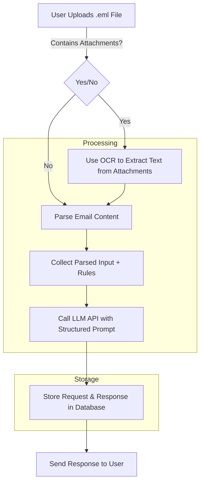

# 📌 Architecture Overview

## 🏗️ System Components

### FastAPI Backend
- Orchestrates everything (API calls, preprocessing, storing results).
- Handles email ingestion, parsing, and classification requests.

### LLM Classification
- Processes emails based on predefined rules.
- Classifies emails into relevant categories.
- Extracts key details such as request type and sub-type.

### Storage
- Stores user-defined classification rules.
- Maintains classification results for emails.

### Frontend (Optional for PoC)
- Simple UI for uploading emails.
- Displays classified results in an easy-to-read format.

---

## 🛠 Components & Their Responsibilities

### 🎛️ User Interface (Optional)
- Upload `.eml` files.
- View classified emails in a structured manner.

### 🚀 FastAPI Backend (Orchestrator)
- Receives and processes emails.
- Extracts email content (subject, body, attachments).
- Fetches stored classification rules.
- Calls the LLM for email classification.
- Stores and returns classification results.

### 🤖 LLM (API-based or Local Model)
- Classifies emails according to predefined rules.
- Extracts structured information such as:
  - Request type
  - Sub-type
  - Key details

### 🗄️ Database / JSON Storage
- Stores classification rules for the system.
- Maintains processed email classifications for retrieval.

---

## 📊 System Flow Diagram (Mermaid)


---

🔧 This architecture provides a scalable and flexible foundation for email classification using Gen AI.

# 📌 Project: AI-Powered Email Classification System

## 📂 Project Structure

```
📂 project-root/
│── 📂 src/
│   ├── 📂 api/                 # API Endpoints
│   │   ├── rules.py            # Endpoint for uploading rules
│   │   ├── classify.py         # Endpoint for classifying emails
│   │   ├── __init__.py
│   │
│   ├── 📂 services/            # Business Logic
│   │   ├── rule_manager.py     # Manages rule storage and retrieval
│   │   ├── email_parser.py     # Parses .eml files and extracts content
│   │   ├── llm_client.py       # Calls the LLM for classification
│   │   ├── __init__.py
│   │
│   ├── 📂 storage/             # Temporary In-Memory Storage
│   │   ├── temp_store.py       # Stores parsed emails and rules
│   │   ├── __init__.py
│   │
│   ├── 📂 utils/               # Utility Functions
│   │   ├── file_handler.py     # Handles file uploads and parsing
│   │   ├── response_formatter.py # Formats response for UI
│   │   ├── __init__.py
│   │
│   ├── main.py                 # FastAPI entry point
│   ├── config.py               # Configuration settings
│   ├── requirements.txt        # Python dependencies
│
├── 📂 ui/                      # Frontend (if applicable)
│   ├── index.html              # Dashboard UI
│   ├── dashboard.js            # Handles API calls & UI updates
│   ├── styles.css              # UI Styling
│
└── README.md                   # Project documentation
```

## 📌 Responsibilities & Workflow

1. **User Uploads Email (.eml) File** (May contain attachments)
2. **Parse Input:** Extract email body & use OCR for attachments (if needed)
3. **Apply Rules:** Collect parsed content + predefined rules
4. **LLM Classification:** Send structured prompt to LLM for classification
5. **Store & Respond:** Store the request & response (using in-memory storage) and return results

## 📌 Tech Stack

- **Backend:** FastAPI (Async APIs)
- **Storage:** In-memory dictionary (for now, DB integration later)
- **Processing:** OCR for attachments, LLM API for classification
- **Frontend:** Simple Dashboard with results display

## 📌 API Endpoints

1. **POST /upload-rules** → Upload a text file with classification rules
2. **POST /upload-email** → Upload an `.eml` file for processing

## 📌 Next Steps

- Define structured API request/response formats
- Implement core functionality first, refine later
- Create UI dashboard with a button to display classification results in a modal


